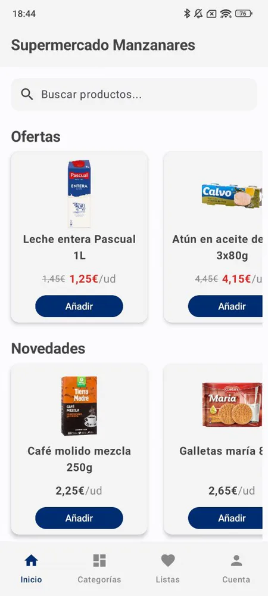
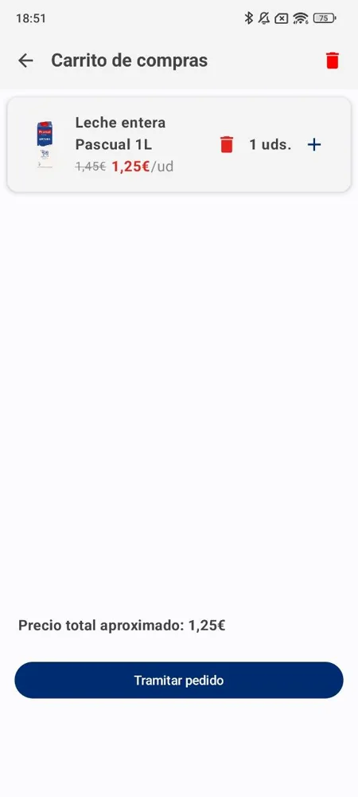
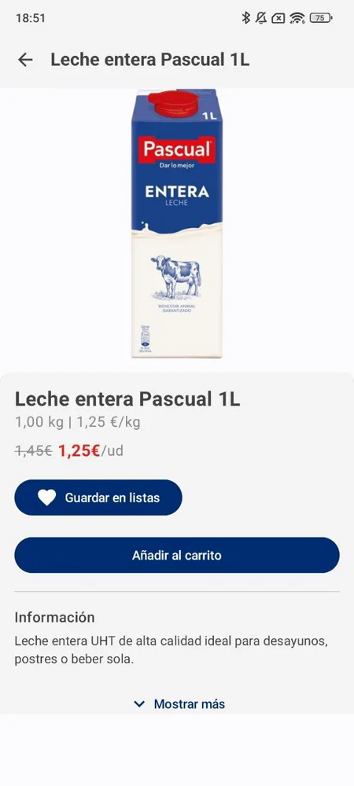
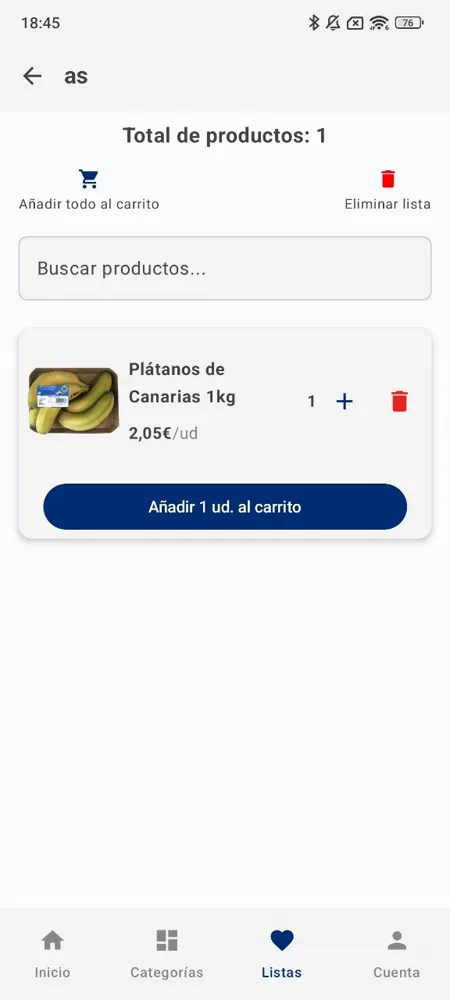
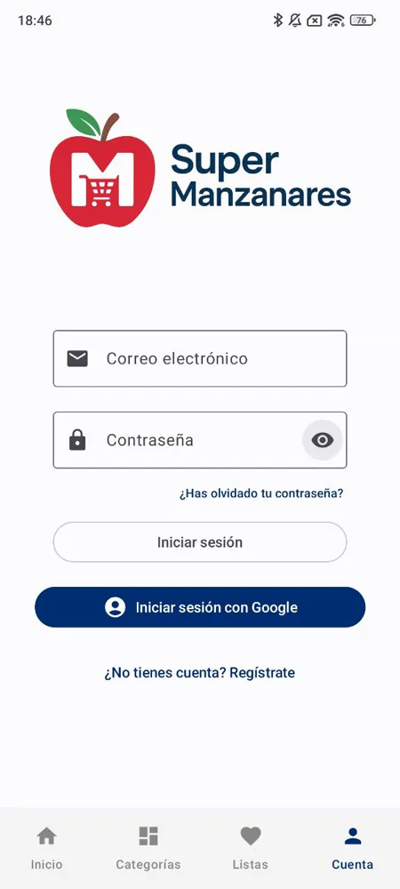
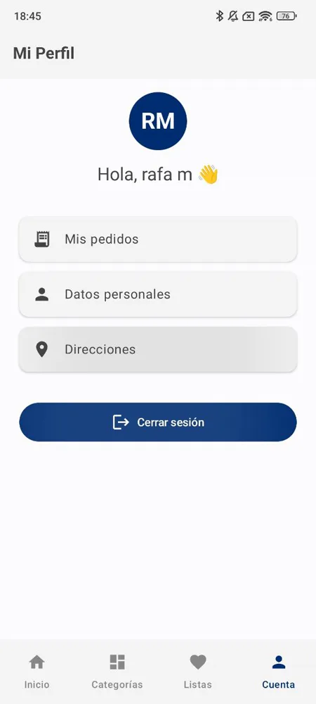
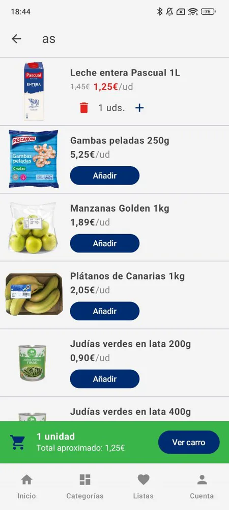
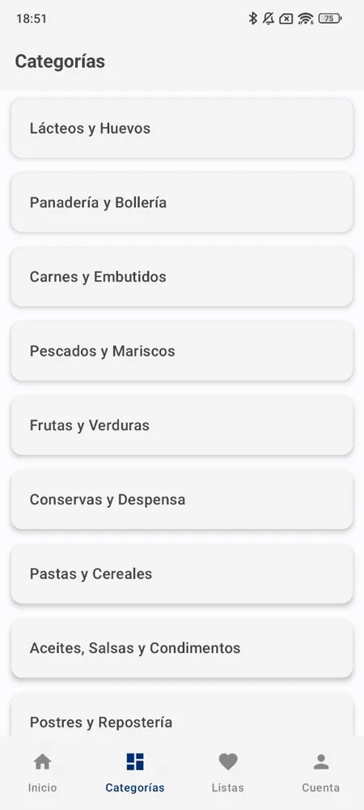
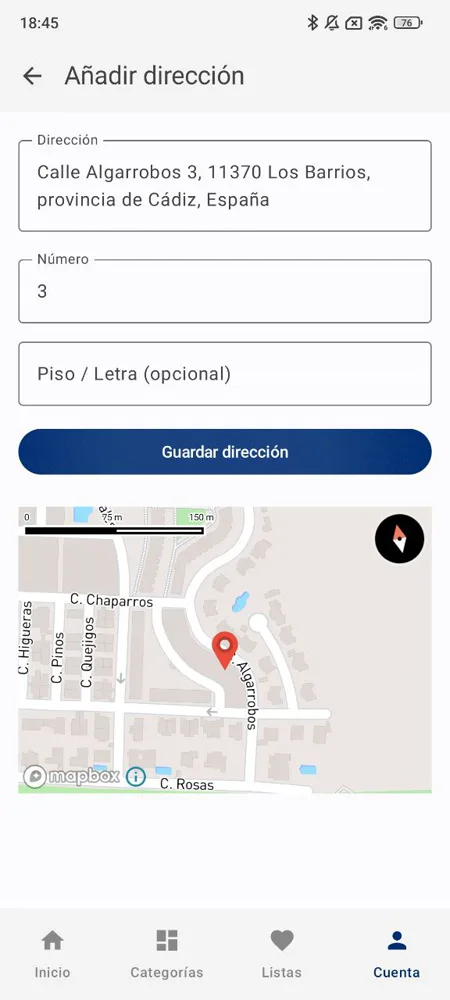

# SuperManzanares 🛒


Aplicación de supermercado desarrollada en Android con **Jetpack Compose** y **MVVM + Clean Architecture**. Proyecto final de grado (TFG) del ciclo superior de DAM.

---

## Capturas de pantalla

| Inicio | Carrito | Detalle de producto |
|--------|---------|---------------------|
|  |  |  |

| Listas de compra | Inicio de sesion | Perfil |
|-----------------|---------------------|--------|
|  |  |  |

| Buscador | Categorias | Direccion |
|-----------------|---------------------|--------|
|  |  |  |

---

## Funcionalidades

- **Autenticación**: registro, inicio de sesión, verificación de email y recuperación de contraseña con Firebase Auth
- **Catálogo de productos**: navegación por categorías, buscador en tiempo real y skeleton loading con shimmer
- **Pull-to-refresh** para actualizar el catálogo sin reiniciar la app
- **Carrito de compra**: añadir, modificar cantidad y eliminar productos con feedback háptico
- **Pedidos**: confirmación de pedido, pantalla de éxito animada e historial de pedidos
- **Listas de compra**: crear, editar y eliminar listas; añadir productos individualmente o todos al carrito
- **Perfil de usuario**: editar nombre, email y direcciones guardadas
- **Autocompletado de direcciones** con Mapbox SDK
- **Modo edge-to-edge** con insets dinámicos y barra de navegación transparente
- **Animaciones**: transiciones entre pantallas, AnimatedContent, AnimatedVisibility y animateItem

---

## Arquitectura

```
ui/
├── screens/          ← Composables por pantalla
├── components/       ← Componentes reutilizables (ProductCard, CartItem, Shimmer…)
├── navigation/       ← NavGraph y NavigationEvents
└── SuperManzanaresApp.kt

viewmodel/            ← ViewModels con StateFlow / SharedFlow

data/
├── local/            ← Room (AppDatabase, DAOs, entidades)
├── remote/           ← Firestore
└── repository/       ← Repositorios (única fuente de verdad)

di/                   ← Módulos Hilt
```

**Flujo de datos:**

```
UI (Compose)
    ↕ collectAsStateWithLifecycle
ViewModel (StateFlow)
    ↕ suspend functions
Repository
    ├── Room (lectura/escritura local)
    └── Firestore (sincronización remota)
```

---

## Tecnologías

| Área | Tecnología |
|------|-----------|
| UI | Jetpack Compose + Material3 |
| Lenguaje | Kotlin |
| Arquitectura | MVVM + Clean Architecture |
| Inyección de dependencias | Hilt |
| Base de datos local | Room |
| Backend / Auth | Firebase Firestore + Firebase Auth |
| Imágenes | Coil |
| Mapas / Direcciones | Mapbox SDK |
| Serialización | Gson |
| Async | Coroutines + Flow |

---

## ⚠️ Ficheros no incluidos en el repositorio

Dos ficheros con credenciales están excluidos del control de versiones. Es necesario crearlos antes de compilar.

### `app/google-services.json`

Descárgalo desde la **Consola de Firebase** → tu proyecto → Configuración del proyecto → Aplicaciones Android → Descargar `google-services.json` → colocarlo en `app/`.

### `app/src/main/res/values/strings.xml`

Crea el fichero con este contenido mínimo:

```xml
<resources>
    <string name="app_name">SuperManzanares</string>
    <string name="mapbox_access_token">TU_MAPBOX_ACCESS_TOKEN</string>
    <string name="default_web_client_id">TU_WEB_CLIENT_ID</string>
</resources>
```

- `mapbox_access_token`: obténlo en [account.mapbox.com](https://account.mapbox.com) → Tokens.
- `default_web_client_id`: Consola de Firebase → Autenticación → Método de inicio de sesión → Google → ID de cliente web.

---

## Primeros pasos

1. Clona el repositorio:
   ```bash
   git clone https://github.com/rafamartinez99/SuperManzanares.git
   ```
2. Crea `app/google-services.json` y `app/src/main/res/values/strings.xml` tal como se indica arriba.
3. Abre el proyecto en **Android Studio Hedgehog** o superior.
4. Sincroniza Gradle y ejecuta en un emulador o dispositivo con API 26+.

---

## Decisiones de diseño destacadas

- **Datos de productos en JSON**: los 55 productos se cargan desde `assets/default_products.json` con carga lazy mediante Gson, reduciendo `ProductRepository` de 1 471 a 93 líneas.
- **Insets dinámicos**: el padding inferior del contenido se calcula en `SuperManzanaresApp` con `animateDpAsState` para suavizar la aparición/desaparición de la barra del carrito (80 dp navBar + 64 dp cartBar + altura de la barra del sistema).
- **Scroll-to-top sin re-navegar**: cuando el usuario pulsa la pestaña activa en la bottom bar se emite un evento en `NavigationEvents.scrollToTop` (SharedFlow) en lugar de navegar de nuevo, evitando la animación de transición innecesaria.
- **Error handling centralizado**: cada ViewModel expone un `errorMessage: StateFlow<String?>` que las pantallas consumen con un Snackbar, sin propagar excepciones a la capa UI.

---

## Licencia

Este proyecto se distribuye bajo la licencia MIT. Consulta el fichero [LICENSE](LICENSE) para más información.
